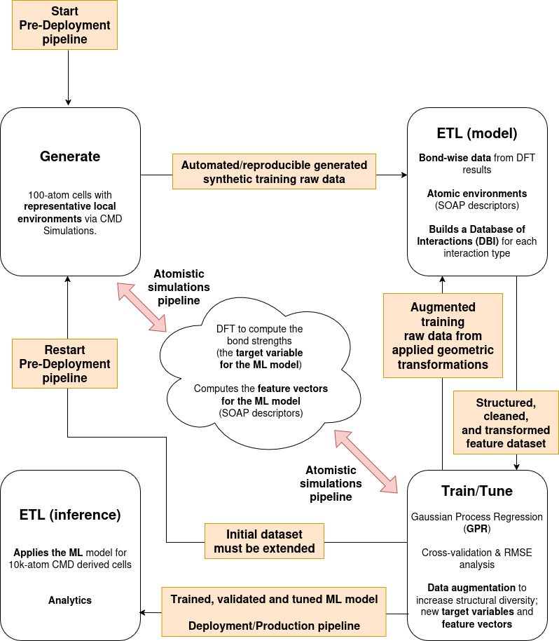
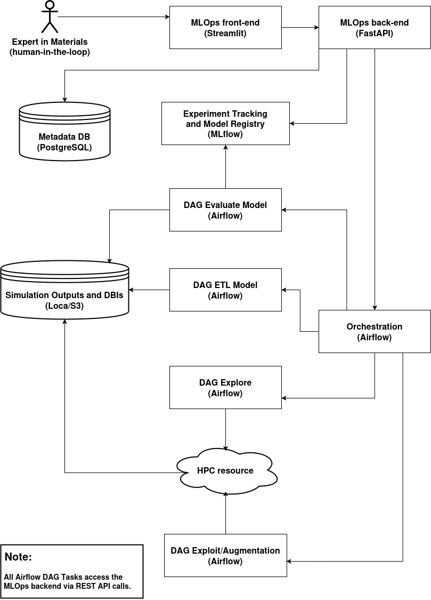

# PRM_4_113603_MLOps

This repository contains an ongoing **Python-based** implementation of the MLOps workflow in terms of the Generate+ETL (GETL) framework used in **Phys. Rev. Materials 4, 113603** (DOI: https://doi.org/10.1103/PhysRevMaterials.4.113603; or the [preprint](https://www.researchgate.net/publication/345634787_Chemical_bonding_in_metallic_glasses_from_machine_learning_and_crystal_orbital_Hamilton_population)):

📝 **NOTE:** Check the original work at:

- 🔗 https://github.com/aryrfjr/PRM_4_113603.

## 🧪 1. Problem Definition & Domain Context

- **Goal**: Predict chemical **bond strengths** (-ICOHP values) in metallic glasses at density functional theory (DFT)-level accuracy.

  - 📝 **NOTE**: Within the context of Computational Chemistry, the "integrated COHP (the -ICOHP value) hints towards the **bond strength**"; COHP stands for ([Crystal Orbital Hamilton Populations](https://schmeling.ac.rwth-aachen.de/cohp/index.php?menuID=1)).

- **Challenge**: Direct DFT computation is computationally infeasible for large-scale (e.g. 10k-atom) systems, whose atomic level whole structure is more realistic.

## 🧩 2. Data Generation & Labeling (DataOps phase)

- **Raw Data Sources**:

  - Classical Molecular Dynamics (CMD) simulations are used to generate an ensemble of smaller systems (100-atom cells) whose atomic level local environments are representative of those found on large-scale systems.

  - Feasible first-principles electronic structure simulations based on DFT to compute -ICOHP values (**labels**) for the smaller systems.

- **Data Engineering**:

  - Convert atomic configurations (local environment around central atoms in terms of its neighbours; or simply **local atomic fingerprints**) to SOAP descriptors (**feature engineering**).
 
    - 📝 **NOTE**: Within the context of Computational Chemistry/Materials Science, SOAP stands for ([Smooth Overlap of Atomic Positions](https://doi.org/10.1103/PhysRevB.87.184115)).

    - 📝 **NOTE**: SOAP vectors are analogous to contextual word embeddings in **NLP** (Natural Language Processing), such as those produced by **BERT** (Bidirectional Encoder Representations from Transformers), in that they both encode rich, structured environments into high-dimensional vectors where geometric proximity reflects functional or semantic similarity.

  - Database of interactions (DBIs) includes **bond distance**, **bond strengths**, and **local atomic fingerprints**.

    - 📝 **NOTE**: In the end, what has been implemented was a **Feature Store Lite**, where each output DBI is the **structured** and **versioned input** to the ML model. 

- **Labeling Strategy**:

  - -ICOHP values calculated via DFT and COHP analysis are used as **supervised labels**.

## 🛠️ 3. Model Development (ModelOps phase)

- **Machine Learning (ML) Approach**: Gaussian Process Regression (GPR).

- **Feature Inputs**:

  - SOAP vectors for atoms in bonds (the SOAP descriptor itself is a feature vector; the ***dot product-based SOAP kernel*** measures similarity and can be used to derive a ***metric distance***).

  - Bond distances.

- **Custom Kernel Function**:

  - Designed to combine bond distance and SOAP similarity.

- **Output**: Predicted -ICOHP value (bond strength).

- **Evaluation**:

  - Root Mean Square Error (RMSE) on test data per **bond/interaction type**.
 
  - **Data augmentation** by applying geometric transformations (shear, tension, compression) to 100-atom cells generated by MD simulations to generate more structural diversity and improve ML generalization.

  - Satisfactory performance demonstrated with small training sets.

## 📐 Architecture Diagram of the MLOps System

The architecture consists of a set of services (**Streamlit**, **FastAPI**, **Airflow**, and **MLflow**) which coordinate the execution of key components such as the **data explorer** and **augmenter**, the **human-in-the-loop active learning** process, and **feature extraction** pipeline.

### 🔍 Key Services

- 📊 **UI and Control Integration**:

  - **Streamlit**: Presents model status, results, and enables expert input (e.g., approve/label samples, restart pipelines).
    - 🔗 http://localhost:8501
  
  - **FastAPI**: Controller layer that handles all user-triggered interactions (via **Streamlit**) and acts as the central gateway.
  - 🔗 http://localhost:8000/docs
  
- 🛠️ **Workflow Orchestration**:

  - **Airflow**: Orchestrator that manages explore/exploit workflows, simulation preparation, and training DAGs (the **Airflow** Directed Acyclic Graphs).
    - 🔗 http://localhost:8080

- 🧪 **ML Lifecycle Tools**:

  - **MLflow**: The central model tracking hub for experiment tracking and model registry and lineage.
    - 🔗 http://localhost:5000
  
  - **PostgreSQL**: For structured data storage, supporting **Airflow**, the **Feature Store** (**Lite**), and experiment metadata tracking.

### 🔍 Key Components

- **DAG Explore**: Start/restart the generation of new (or the first ones) 100-atom cells via CMD for a given Nominal Composition (NC). When used within the context of **human-in-the-loop active learning**, it can be used to improve **data coverage** (configurational diversity in terms of structure) without adding new NCs, or to bring better **generalization** by creating 100-atom cells for new NCs.

- **DAG Exploit/Augment**: Perform **data augmentation** (shear, tension, compression) on existing 100-atom cells when the structural diversity of current configs needs improvement without having to run a new CMD simulations.

- **DAG ETL Model**: Manage the portion of the **Feature Store Lite** that contains the **engineered features** with versioned descriptors (SOAP + bond info) used for training/inference. This is the task that creates the DBIs.

  - 📝 **NOTE**: The RMSE per bond type was the only metric used in the original work, but in this MLOps system ML model evaluation will be supported by:

  | Metric                   | Purpose                                                                    |
  | ------------------------ | -------------------------------------------------------------------------- |
  | **RMSE per bond type**   | Diagnostic for model accuracy across chemically distinct interaction types |
  | **Uncertainty score**    | Informs active learning decisions (which bonds to label next)              |
  | **Acquisition function** | Combine uncertainty + diversity for smarter exploration                    |

  - 📝 **NOTE**: Below the different kinds of structured databases used in this MLOps system:

  | Type               | Stores What?                                   | Example                             |
  | ------------------ | ---------------------------------------------- | ----------------------------------- |
  | **Feature Store**  | Engineered features (e.g., SOAP vectors)       | Vector for Zr–Cu bond, version 3    |
  | **Metadata Store** | Simulation params, job runs, uncertainty, etc. | SLURM job ID 12345 ran at temp=300K |
  | **NC Registry**    | Canonical materials/entities                   | Zr49Cu49Al2, system ID 1001         |

- **DAG Evaluate Model**: This is the task that provides user with the supporting information for the decision on next steps. This is a key part of **model evaluation** and **active learning** policy in the proposed **physics-informed MLOps system**, and allows the assessment of the predicted -ICOHP (bond strength) across various bond types in the metallic glasses using two types of analysis:

  - **Cross-validation**: Evaluate model fit using a structured training/testing split from **PBSSDB** (per-bond single SOAP database) datasets, with a focus on hyperparameterized GPR fitting. Supports cross-NC validation (training and test sets from different NCs and their respective **PBSSDBs**). The core metric is the RMSE per bond type and it is suitable for model tuning, hyperparameter sweeps, and reproducibility.

  - **Single-cell validation**: Validate the ML model in production-like conditions, using a real simulation from a specific 100-atom cell and comparing to the true DFT-calculated -ICOHP values. The training data comes from a mixed, pre-built DBI and it is useful for answering: "*How well does this model generalize to unseen, full-system data?*". It basically bridges the gap between **training/validation** and **production inference**.

  - 📝 **NOTE**: Below is a summary of the **human-in-the-loop active learning** policy in the proposed **physics-informed MLOps system**:

  | Decision Point                                                                            | Trigger                        |
  | ----------------------------------------------------------------------------------------- | ------------------------------ |
  | RMSE too high on current dataset, but data coverage seems OK (structurally)               | Run more **augmentations**     |
  | RMSE too high due to lack of configurational diversity (not enough 100-atom cell samples) | Create more **100-atom cells** |
  | RMSE too high due to poor generalization across compositions                              | Add **new NCs**                |

- **HPC Interface**: Bridge to job submission on non-cloud-native systems (e.g., LAMMPS, QE via SLURM).
  - ⚠️ **NOTE**: Since there is no HPC resource accessible right now, the system has a component that mimics production pipelines while being cost-efficient for research/demo purposes. Click on the following link for more information about all the [third-party software used in atomistic simulations](https://github.com/aryrfjr/PRM_4_113603?tab=readme-ov-file#-third-party-software-used-in-atomistic-simulations).

- **Local/S3 Store**: Stores raw MD output, DFT results, SOAP descriptors, trained models.
  - ⚠️ **NOTE**: Also due to the unavailability of HPC resource, the outputs generated by the standard simulation tools (e.g., LOBSTER, QE) in the original work **locally stored** is being used. Click on the following link to inspect some [data samples](https://github.com/aryrfjr/PRM_4_113603/tree/main/data_examples).
