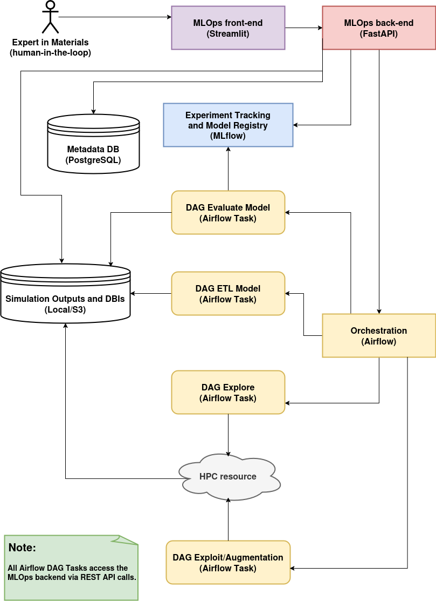

# PRM_4_113603_MLOps

Below is an illustration of the MLOps workflow in terms of the Generate+ETL (GETL) framework used in **Phys. Rev. Materials 4, 113603** (DOI: https://doi.org/10.1103/PhysRevMaterials.4.113603; or the [preprint](https://www.researchgate.net/publication/345634787_Chemical_bonding_in_metallic_glasses_from_machine_learning_and_crystal_orbital_Hamilton_population)):

## 🧪 1. Problem Definition & Domain Context

- **Goal**: Predict chemical **bond strengths** (-ICOHP values) in metallic glasses at density functional theory (DFT)-level accuracy.

  - 📝 **NOTE**: Within the context of Computational Chemistry, the "integrated COHP (the -ICOHP value) hints towards the **bond strength**"; COHP stands for ([Crystal Orbital Hamilton Populations](https://schmeling.ac.rwth-aachen.de/cohp/index.php?menuID=1)).

- **Challenge**: Direct DFT computation is computationally infeasible for large-scale (e.g. 10k-atom) systems, whose atomic level whole structure is more realistic.

## 🧩 2. Data Generation & Labeling (DataOps phase)

- **Raw Data Sources**:

  - Classical Molecular Dynamics (CMD) simulations are used to to generate an ensemble of smaller systems (100-atom cells) whose atomic level local environments are representative of those found on large-scale systems.

  - Feasible first-principles electronic structure simulations based on DFT to compute -ICOHP values (**labels**) for the smaller systems.

- **Data Engineering**:

  - Convert atomic configurations (local environment around central atoms in terms of its neighbours; or simply **local atomic fingerprints**) to SOAP descriptors (**feature engineering**).
 
    - 📝 **NOTE**: Within the context of Computational Chemistry/Materials Science, SOAP stands for ([Smooth Overlap of Atomic Positions](https://doi.org/10.1103/PhysRevB.87.184115)).

  - Database of interactions (DBIs) includes **bond distance**, **bond strengths**, and **local atomic fingerprints**.

    - 📝 **NOTE**: In the end, what has been implemented was a **Feature Store Lite**, where each output DBI is the **structured** and **versioned input** to the ML model. 

- **Labeling Strategy**:

  - -ICOHP values calculated via DFT and COHP analysis are used as **supervised labels**.

## 🛠️ 3. Model Development (ModelOps phase)

- **Machine Learning (ML) Approach**: Gaussian Process Regression (GPR).

- **Feature Inputs**:

  - SOAP vectors for atoms in bonds (the SOAP descriptor itself is a feature vector; the ***dot product-based SOAP kernel*** measures similarity and can be used to derive a ***metric distance***).

  - Bond distances.

- **Custom Kernel Function**:

  - Designed to combine bond distance and SOAP similarity.

- **Output**: Predicted -ICOHP value (bond strength).

- **Evaluation**:

  - Root Mean Square Error (RMSE) on test data per **bond/interaction type**.
 
  - **Data augmentation** by applying geometric transformations (shear, tension, compression) to 100-atom cells generated by MD simulations to generate more structural diversity and improve ML generalization.

  - Satisfactory performance demonstrated with small training sets.

## 📐 Architecture Diagram of the MLOps System

The architecture consists of a set of services (Streamlit, FastAPI, Airflow, and MLflow) which coordinate the execution of key components such as the data explorer and augmenter, the human-in-the-loop active learning process policy, and feature extraction pipeline.

- Streamlit: [http://localhost:8501](http://localhost:8501)
- REST API: [http://localhost:8000/docs](http://localhost:8000/docs)
- Airflow: [http://localhost:8080](http://localhost:8080)
- MLflow: [http://localhost:5000](http://localhost:5000)
